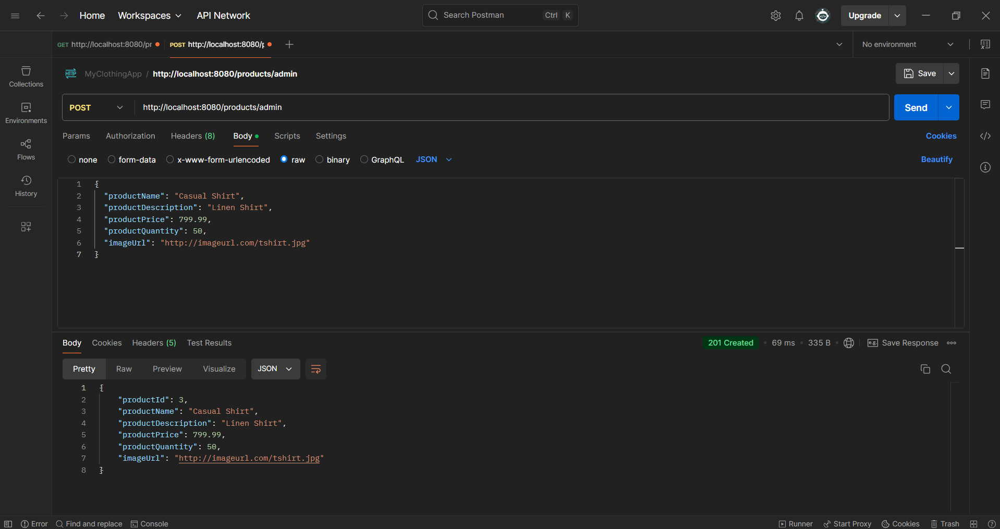
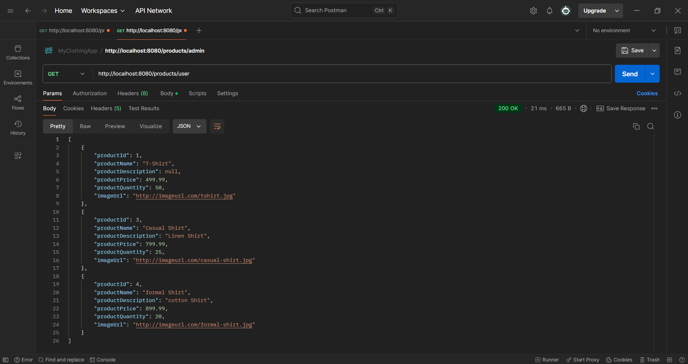
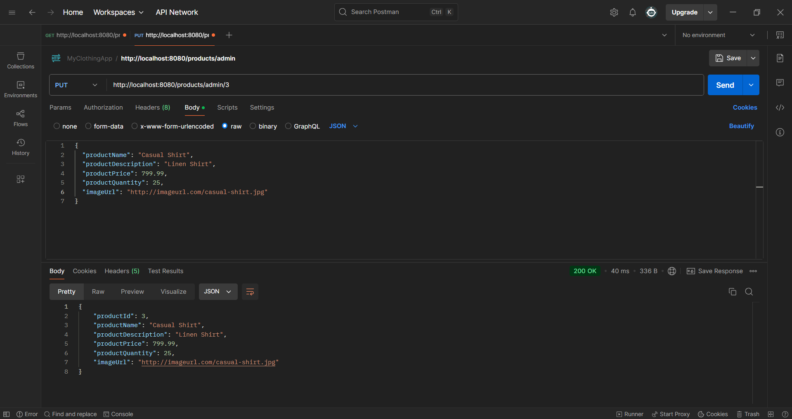
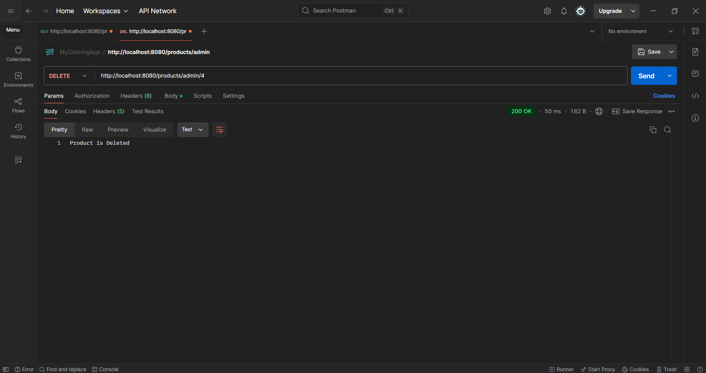
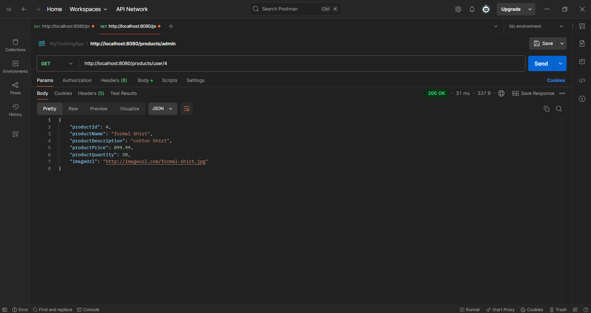

# Online Clothing Store Backend
>>Just pushed Prduct Module, Yet to commit many modules related to project<<
This is the backend for an **Online Clothing Store** application built with **Spring Boot**, **Spring MVC**, **Spring Data JPA**, **Hibernate**, and **MySQL**. The backend provides REST APIs to manage products, users, and the store.

## Technologies Used
- **Java 17**
- **Spring Boot 2.x**
- **Spring MVC**
- **Spring Data JPA**
- **Hibernate**
- **MySQL**
- **Postman** (for API testing)

## Features
- **Product Management**: 
  - Add, update, delete, and view products.
  - Support for images uploaded through image link / will update it as multipart files in future .
- **User Management**:
  - Allows basic CRUD operations for users (admin only).
  
## Setup

### Prerequisites
Before running this project, you need to have the following installed:
- **Java 17** or higher
- **MySQL** (or any other RDBMS if configured)
- **Eclipse IDE** (for development)
- **Maven** (for building the project)

### API Testing Screenshots

#### Create Product API

#### Get All Products API

#### Update All Products API

#### Delete All Products API

#### Get Product by ID Products API

